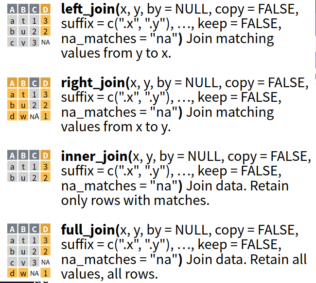
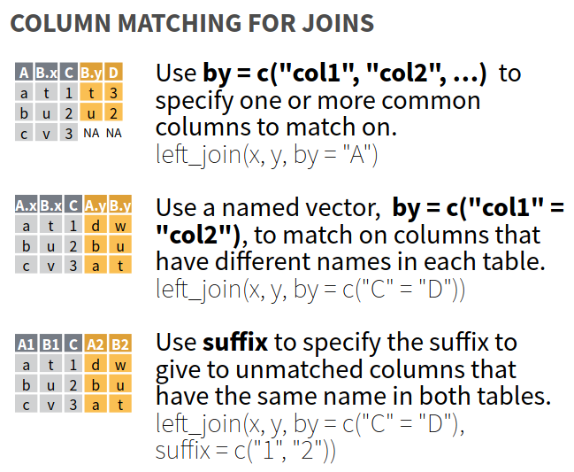

Tutorial 10
================

# Unindo data-frames (*joins*)

É extremamente comum que trabalhemos com a conjugação de dados de
origens diferentes. Nestes casos, podemos reunir as informações dos
diferentes bancos num único a partir de funções do tipo *join*. Claro
que existe um limite de memória, caso você queira reunir centenas de
variáveis a respeito das mesmas observações, mas você sempre pode
incorporar colunas de outras tabelas no seu \*data frame e selecionar um
conjunto que seja menor e lhe faça sentido.

Mas veja, é importante que você tenha clareza na operação que estará
executando, já que cada banco de dados faz referência a variáveis
diferentes. É preciso que:

- A unidade de análise de cada observação seja a mesma. Se nas suas
  linhas estão municípios não adianta colocar um banco de dados que
  analisa bairros ou macroregiões. Mas você poderia ainda argumentar que
  se você reunir as informações dos bairros, poderia utilizar, certo?
  Sim e não. Depende da natureza das suas variáveis, já que você pode
  incorrer em algum tipo de falácia ecológica.

- Cada banco deve identificar exclusivamente cada observação, para que
  não haja duplicações. Claro que aqui também a melhor resposta é
  depende, já que você pode desejar duplicar por alguma opção
  metodológica de pesquisa. O que disse aqui diz respeito ao que se
  espera.

- E o mais importante: Você precisará de uma **chave** que esteja
  presente em ambos os bancos de dados. Ou seja, precisa de
  identificadores que sejam compartilhados e permitam que você cruze
  seus dados. Como um ‘elo’ que conecte todas as variáveis - um
  identificador comum a eles.

Vamos ver um exemplo. Imagine que queremos reunir dois bancos de dados
que possuem (1) a mesma unidade de análise (municípios) e detêm o mesmo
identificador único (código numérico do IBGE para os municípios
brasileiros). Veja o exemplo abaixo, o banco de dados A e o B têm,
ambos, o identificador comum ‘Município’ que usaremos para unir as
variáveis ‘Gasto orçamentário Saúde’ e ‘Hospital Oncológico SUS’.

<p align="center">

</p>

Mas veja, este exemplo é o mundo ideal: um mesmo identificador; bancos
completos e mesma unidade de análise. Vamos deixar isso um pouco mais
complicado.

## Unidades de análise diferentes

Imagine que agora temos um banco de dados com informações sobre os
estados brasileiros e outro com informações sobre os municípios. Como já
adiantei a você, isso pode ser uma fonte de erros metodológicos graves
na sua pesquisa/análise (então, cuidado nas escolhas que fará). Mas
vamos ignorar essa parte para efeitos didáticos. Como faríamos para unir
as variáveis num único banco?

              TABELA A                                      

|  UF | Hospital Oncológico SUS |
|----:|------------------------:|
|  AC |                     não |
|  AL |                     não |
|  AP |                     não |
|  AM |                     sim |
|  BA |                     sim |
|  CE |                     sim |
|   … |                       … |

            TABELA B              
            

|  Município |  UF | Gasto com Saúde |
|-----------:|----:|----------------:|
|   Basileia |  AC |   R\$ 2.000.000 |
|     Bujari |  AC |     R\$ 800.000 |
| Rio Branco |  AC |  R\$ 80.000.000 |
|    Sergipe |  SE | R\$ 120.000.000 |
|     Manaus |  AM | R\$ 520.000.000 |
|  Fortaleza |  CE | R\$ 990.000.000 |
|          … |   … |               … |

**Primeira forma (Municípios viram estados)** A primeira estratégia
seria agregar o banco que tem mais variáveis no que tem menos. Para
isso, seria preciso adaptar as informações de ‘Gasto com Saúde’ para
constar como variável das observações da primeira tabela. Ou seja, seria
preciso fazer uma opção metodológica: se quero “somar o gasto com saúde
dos municípios”, ou calcular a “média do gasto”, ou calcular “mediana do
gasto etc… para fazer incluir em uma nova coluna da Tabela A.

Feita tal escolha, usamos as variáveis já conhecidas de “group_by(UF)
%\>% mutate(nova_variavel=summarize(sum()))”. Isso fará com que a nova
variável traga, para cada linha da Tabela B, o mesmo valor da somatória
dos valores dos municípios.

                     TABELA B                      

|  Município |  UF | Gasto com Saúde | Gasto estadual |
|-----------:|----:|----------------:|---------------:|
|   Basileia |  AC |    2.000.000 \* | –\> 82.800.000 |
|     Bujari |  AC |      800.000 \* | –\> 82.800.000 |
| Rio Branco |  AC |   80.000.000 \* | –\> 82.800.000 |
|    Sergipe |  SE |     120.000.000 |              … |
|     Manaus |  AM |     520.000.000 |              … |
|  Fortaleza |  CE |     990.000.000 |              … |
|          … |   … |               … |              … |

Feito isso, faríamos a união da Tabela B com a Tabela A, usando a
variável ‘UF’ (comum a ambas) como nossa chave do *join*. Como algumas
variáveis deixaram de fazer sentido “Município” e “Gasto com saúde”,
excluiríamos elas no processo de união. A tabela ‘Resultado’ teria a
variável identificadora “UF”, a variável recodificada do ‘gasto
estadual’ e a variável original “Hopistal Oncológico SUS”. Seria algo
como o que segue:

                   RESULTADO                   

|  UF | Gasto estadual | Hospital Oncológico SUS |
|----:|---------------:|------------------------:|
|  AC | –\> 82.800.000 |                     nao |
|  AC | –\> 82.800.000 |                     nao |
|  AC | –\> 82.800.000 |                     nao |
|  SE |              … |                     nao |
|  AM |              … |                     sim |
|  CE |              … |                     sim |
|   … |              … |                       … |

**Segunda forma** A outra opção é você duplicar os dados da Tabela com
menos observações (Tabela A). Ou seja, como a Tabela B traz as
informações agregadas por Estado, o processo de *join* faria a
multiplicação da variável ‘Hospital oncológico SUS’ para cada município
(da Tabela B) daquele Estado representado na Tabela A.

Claro que você já deve ter percebido, que o fato do Estado de São Paulo
ter ‘sim’ para a variável ‘Hospital oncológico SUS’ na Tabela A, não
permite que você afirme que Borá-SP tenha o hospital. Isso é para você
perceber que o processo de *join* tem mais problemas metodológicos do
que na sua linha de programação.

- **E quando não existe identificador comum às tabelas que desejo
  unir?**

A resposta mais imediata é: Você não consegue unir. A resposta mais
completa: Caso você não tenha um identificador comum, você ainda poderá
criar um variável em algum dos bancos - a partir das informações que
eles possuem -, para que funcione como a chave do seu *join*. No nosso
exemplo, caso você não tivesse a variável UF na tabela B, precisaria
buscar um outro banco de dados (possivelmente,
eleitoral/administrativo/fiscal) com a lista de municípios e seus
respectivos estados (UF’s). Faria primeiramente um *join* destes bancos,
para depois realizar o *join* da Tabela A e da Tabela B.

## Mãos à massa

Resumindo o que você viu até agora, poderia dizer que refletiu acerca
dos passos que te preparam para realizar a união das informações: (1)
Verificar qual a unidade da análise dos bancos de dados pretendentes à
união e qual seria a unidade de análise do eventual resultado; (2) Se
for necessário, pensar em como agregar informações para ter a unidade de
análise desejada; (3) Se for necessário, pensar em como transformar
alguma variável para criar um identificador comum (*chave*) a ambos os
bancos.

Certo. Como agora você já tem uma certa ideia do que se trata, vamos
realizar alguns *joins* para ver a sintaxe das funções e os problemas
que podem surgir no caminho. Para isso, faremos uso da função
*left_join()* que é filha do pacote *tidyverse*.

Para isso, você vai precisar definir **obrigatoriamente** três
argumentos/atributos da função:

- Os nomes dos DOIS bancos/tabelas/data.frames que você deseja unir.
  Evidentemente, que a esta altura você sabe que estes dois precisam ser
  objetos do seu *Global Environment*.
- O identificar comum a esses objetos, ou seja, a coluna/variável que
  está presente em ambos; pois é por meio dela que o R irá realizar a
  união. O R vai combinar as colunas das observações com o mesmo valor
  de identificador comum nos dois bancos e insira-as como uma linha na
  nova tabela.

Já adianto que a resposta é não. Você precisa realizar uma junção de
cada vez, caso deseje unir mais que dois bancos. Não é possível unir
mais que dois ao mesmo tempo - ainda que tenham presente a mesma chave.

A sintaxe da operação de *join* ficaria parecido com:

> tabela_resultado \<- tabela_1 %\>% left_join(tabela_2, “chave”)

Vamos entender o código fictício acima. A primeira coisa é que
**sempre** começará pela tabela que já possui a unidade de análise e o
número de observações/linhas que desejo que constem depois na ‘tabela
resultado’. Portanto, é a ‘tabela_1’ que é o objeto que sofrerá a junção
e, por isso, aparece antes do operador pipe (%\>%). É como se afirmasse:
“pegue a tabela_1 e execute a junção da tabela_2, por meio do
identificador comum que é a coluna/variável ‘chave’”.

Como atributo/argumento da função *left_join()*, ou seja, no interior
dos parênteses, você deve especificar quem o R deve pegar para unir com
o objeto ‘tabela_1’ e por meio de qual coluna que funciona como
identificador comum.

Vamos à prática de verdade, agora. Abrindo dois bancos de dados do
pacote ‘nycflights13’ que trabalhamos em outro encontro. Vamos tentar
unir informações do banco ‘planes’ e do banco ‘flights’. Para que você
saiba como realizar as uniões de maneira lógica, saiba que em ‘flights’
cada linha/observação é um voo que partiu de Nova Iorque, enquanto que
cada linha/observação em ‘planes’ é um avião.

``` r
# Carregando bibliotecas para uso
library("tidyverse")
library("nycflights13")
library("tidylog") # install.packages("tidylog") caso não esteja instalado
```

Portanto, a unidade de análise *pode* vir a ser a mesma. Como é o caso
em que cada trecho que sai de Nova Iorque pode ser feito por muitos
aviões diferentes. A variável que devemos usar como identificador comum
é a ‘tailnum’, presente em ambos os ambos e que individualiza o avião.

Vamos tentar um exemplo em que cada avião faz 1 e somente 1 trecho/voo
específico. Para isso, filtre para um dia e trajeto específico - o que
inviabiliza que um mesmo avião esteja em dois lugares ao mesmo tempo.

``` r
# Filtrando voos por trecho específico
flights_trecho_unico <- flights %>% 
  filter(month == 4 & day == 22 & origin == "JFK" & dest == "ATL")
```

Perceba que só temos 5 aviões para a condição que filtramos acima. E só
há, portanto, valores únicos para a variável ‘tailnum’. Como não temos
valores duplicado, é bem fácil executar o *join*.

``` r
# Join das tabelas 'flights_trecho_unico e 'planes'
flights_trecho_unico %>% 
  left_join(planes, by = "tailnum")
```

Veja só uma coisa. Um pouco atrás neste tutorial, você viu a sintaxe
padrão e não havia o nome do atributo da chave. Só o nome da coluna que
serviria de identificador comum.

> tabela_resultado \<- tabela_1 %\>% left_join(tabela_2, “chave”)

No código em que executamos o *join* com ‘planes’, a chave ‘tailnum’
traz o nome do atributo/argumento da função. Eu tenho feito isso (as
vezes dar o nome do atributo, as vezes só inserir o valor esperado na
posição que o atributo ocuparia por *default*), para que você crie o
hábito de usar a função *help()* para ver a sintaxe de cada função. Como
neste curso não é possível cobrir tudo, é importante que você tenha esse
hábito desenvolvido.

Certo, voltando…

Vamos olhar a tabela que você acabou de gerar mais de perto. É
importante também este exercício, para validação da operação que você
acabou de realizar. O resultado previsto seria uma linha/observação para
cada voo, com as informações sobre os aviões nas colunas à direita do
seu banco. O *join()*, portanto, como que cola as variáveis da tabela ao
final do outro. Mais ou menos como quando você usou *mutate()* e criou
uma variável que apareceu no final à direita de sua tabela original.

Um adendo: você carregou um pacote novo, o *tidylog*. Ele serviu para
resumir os detalhes do *join* que realizamos e imprimir tudo no seu
console. Por isso, você pode verificar quantas observações existiam em
cada tabela (‘matched rows’) e se havia alguma informação faltante
(*missing value*) na tabela que solicitou a união ‘tabela_1’ (‘rows only
in y’) e na tabela que mandou que o R unisse tabela_2 (‘rows only in
x’).

Agora, o que aconteceria caso você não tivesse filtrado os voos como
fizemos? Você teria duplicado informações com absoluta certeza. Isso é
um problema? Poderia ser, depende do seu propósito com este *join*. Se
você estiver ciente das razões desta união e o que deseja na tabela
final como unidade de análise, tudo bem.

Tomemos nosso exemplo para deixar isso mais claro. Você pode desejar ter
nas linhas/observações de sua ‘tabela resultado’ os voos; mas também
pode desejar que as observações sejam os diferentes aviões. A mesma
lógica que você viu com ‘Municípios’ e ‘Estados’ um pouco antes.

**Primeira forma. Agregando o banco com mais unidades naquele que tem
menos**: Você teria que resumir o número de viagens de cada avião,
agregando as informações do database ‘flights’ por ‘tailnum’. Ou seja,
todas as viagens feitas por um mesmo avião (‘tailnum’) seriam colapsadas
numa informação resumo.

``` r
# Obtendo informação resumo
voos_por_aviao <- flights %>% 
  group_by(tailnum) %>%
  tally()
```

Observe que o objeto que criamos (voos_por_aviao) tem menos
observações/linhas que ‘flights’. Além disso, agora as unidades de
análise deste objeto e do database ‘planes’ são a mesma - ou seja, em
ambos os casos, estamos trabalhando com o avião (‘tailnum’). Vamos,
então, usar nosso *join*.

``` r
# Join de 'planes' com 'voos_por_aviao'
planes_viagens <- planes %>% 
  left_join(voos_por_aviao, by = "tailnum")

planes_viagens
```

Como apareceu o objeto ‘planes_viagens’ para você? Agora o database
‘planes’ ganhou uma coluna trazendo a informação do número de viagens de
cada avião (‘tailnum’). Você acabou de obter um resultado muito útil de
maneira rápida e escalável!!! Perceba que o número de observações/linhas
é o mesmo que há no database ‘planes’.

**Segunda Forma. Duplicar informações do banco menor**: Mas você poderia
desejar que a unidade de análise resultante fossem cada voo e não cada
avião, certo? Neste caso, a tabela resultante adicionaria os dados de
cada avião à tabela ‘flights’. Mas veja, como há inúmeros voos para cada
aviao (‘tailnum’), isso implicará em multiplicar os dados de cada avião
toda a vez que ele aparecer no banco ‘flights’ - ou seja, como a unidade
de análise que desejo manter na tabela resultante é o voo (trecho aéreo
entre aeroportos), ao unir a tabela com informações individualizadas por
avião, eu necessariamente estou fazendo que estas informações repitam no
banco ‘flights’. Veja como ficaria:

``` r
# Join de 'flights' com 'planes'
voos_com_aviao <- flights %>% 
  left_join(planes, by="tailnum")
```

Observe que o objeto ‘voos_com_aviao’ possui o mesmo número de
observações/linhas que o database ‘flights’. Para ficar mais claro o que
acabamos de fazer, vamos filtrar ‘voos_com_aviao’ por um único destino e
ordenar as informações conforme o ‘tailnum’, assim, você poderá ver que
os dados de cada avião (oriundos do database ‘planes’) está se repetindo
para cada trecho aéreo que cada avião fez.

``` r
# Filtrando por um único destino e ordenando conforme 'tailnum'
voos_com_aviao %>% 
  filter(dest=="GSO") %>% 
  arrange(tailnum) %>%
  select(tailnum, month, day, dep_time, manufacturer, year.x, year.y, model)
```

No código acima, talvez não tenha passado batido por você que temos duas
variáveis ‘year’, uma com um ‘x’ e outra com um ‘y’. Eu já havia
executado o código e aproveitei para manter as colunas para efeitos
didáticos - por isso, eu seleciono elas na última linha, não foi obra do
destino.

Pois bem e o que havia acontecido no nosso *join* que acabou gerando
estas duas variáveis? O que aconteceu foi que eu usei somente uma
variável de *chave* e o R interpreta todas as demais como variáveis de
interesse que precisam ser incluídas na união. E como tanto o banco
‘flights’, quanto o banco ‘planes’ possuíam a variável ‘year’, o R
adiciona um complemento ao nome das colunas (‘year.x’ e ‘year.y’). Isso
é importante e merece sua atenção! Enquanto o ‘year.x’ faz referência ao
ano da viagem do trecho áereo, ‘year.y’ faz referência ao ano de
fabricação da aeronave!

Por isso é importate nomear as variáveis com descrições claras. Além
disso, você pode renomear as variáveis antes de executar o *join* para
evitar estes problemas; você pode também selecionar as variáveis que
façam sentido na sua análise, evitando que o banco fique imenso e cheio
de ruído.

``` r
planes1 <- planes %>%
  rename("ano_fabricação" = "year")

voos_com_aviao <- flights %>% 
  left_join(planes, by="tailnum")
```

Pronto, agora seu novo objeto está melhor.

## Identificando *missing values*

Vamos deixar as coisas piores, mas muito mais próximas do que você vai
encontrar na vida real. O que aconteceria se eu precisasse unir
informações de tabelas diferentes, sendo que há valores faltantes para
algumas linhas?

Nossos exemplos até agora, ou cada avião existia em ‘flights’ e em
‘planes’, ou cada avião de ‘planes’ existe em ‘flights’. Ou seja, não
houve nenhum casa de um avião que existisse, mas tivesse permanecido em
solo sem voar. Saber disso nos ajudaria a verificar e validar se o
*join* funcionou.

Certo, mas como fazer isso numa tabela com centenas de milhares de
observações?!!?

Bom, você já percebeu que a intenção do curso é nutrir em você o hábito
de usar a linha de código ao invés de botões, bem como, de estudar as
suas tabelas por funções/comandos ao invés de visualizar ela como uma
planilha excel. Por isso, para realizar a tarefa de validação do seu
*join* você pode usar outra função do tipo *join*, que se chama
*anti_join()*.

A sintaxe de escrita do *anti_join()* é exatamente a mesma do
*left_join()*, mas o resultado não é a combinação entre duas tabelas,
mas sim, o que pertence a ‘tabela_1’ e não aparece na ‘tabela_2’.

> validacao \<- tabela_1 %\>% anti_join(tabela_2, by = “chave”)

Veja no nosso exemplo:

``` r
# Validando o left_join
flights %>% 
  anti_join(planes, by="tailnum")
```

Então, vá em ‘flights’ e veja o número de observações (no seu console,
aparecem só os primeiros 10 mil) que têm um ‘tailnum’ que não existe em
planes. O inverso também é possível e simples. Vejamos se existiam
aviões que não partiram de Nova Iorque, invertendo os bancos de dados na
função *anti_join()*.

``` r
planes %>% 
  anti_join(flights, by="tailnum") 
```

Apareceram 9 colunas com zero linhas, certo? Então, ótima notícia pois
todos os aviões descritos na tabela ‘planes’ estão presentes em
‘flights’.

Talvez visualizar as operações em fluxos de operação ajude um pouco.
Abaixo uma figura extraída do cheatsheets do pacote dplyr.



### Faça você mesmo

1.  Crie duas tabelas com a função *tibble()* e una elas por meio de um
    left_join(). Lembre-se de manter uma coluna igual nas duas tabelas
    para funcionar como chave.

2.  Faça um *join* usando ‘flights’ e ‘planes’. Filtre os voos para um
    único dia e verifique qual a marca de avião que mais voou. Obs. A
    função *tally()* do *dplyr* retorna informações sobre a
    operação/comando/função que você realizou. Tente usar group_by +
    tally + top_n em um dos blocos de código.

3.  Agora, faça um resumo do número de voos no ano de 2013 de cada
    companhia. Dica: ‘flights’ não tem o nome por extenso das
    companhias. Faça um *join* entre ‘flights’ e ‘airlines’ para criar
    uma tabela única. Se for preciso, diminua a tabela resultante
    selecionando poucas variáveis.

## *joins* com múltiplas chaves

Vimos até agora a utilização de uma única variável como chave
identificadora, mas é possível indicar ao R que faça uso de mais de uma
coluna.

Por qual razão, você se perguntou. Imagine nosso primeiro exemplo, de
municípios e estados. O Brasil (e não só ele) possui cidades que têm o
mesmo nome, embora estejam em estados diferentes. Se eu usasse somente o
nome do município como chave, estaria criando um problema para mim. Por
isso, normalmente utilizamos para nossa chave uma coluna em que as
linhas assumam 1, e unicamente 1, valor apenas.

Evidentemente que o que queremos é muito diferente do que encontramos no
mundo real. E é por este motivo que você pode usar mais de uma coluna
como identificador. Neste caso, teríamos um par, uma tríade ….
identificadora.

Vamos a um exemplo prático. Tomemos o pacote ‘nycflights13’ novamente,
agora para carregar o database ‘weather’ que traz as condições
metereológicas de cada aeroporto por hora. E agora vamos tentar
descobrir qual seria a condição do tempo para cada voo que partiu de
Nova Iorque. Será necessário que façamos a união entre duas variáveis,
certo? Tanto a localização do aeroporto, quanto a hora do voo.

Para a primeira variável da chave é bem simples. Basta utilizar a
variável ‘origin’ que está presente em ‘weather’ e em ‘flights’. Check.

Para a segunda variável, um pouco mais de trabalho. Precisamos definir o
horário a partir das variáveis ‘year’, ‘month’, ‘day’ e ‘hour’ - ainda
há ‘minutes’, mas como só temos no banco ‘flights’, ignore. Certo, e
como usar todas estas variáveis como identificadores?! Simples: Usando o
já bem conhecido **c()** combinado com o *left_join()*. Veja como
ficaria:

``` r
# Join das informações do clima no banco flights
voos_clima <- flights %>% 
  left_join(weather, c("origin","year","month","day","hour"))
```

Abra voos_clima e veja o que aconteceu.

Ele tem tantas observações quanto ‘flights’ e as 10 colunas de ‘weather’
acrescentadas ao final trazendo informações sobre as condições
climáticas.

Legal. Mas o que aconteceria caso tivéssemos esquecido algum
identificador? Lembre-se que a escolha da chave também é uma escolha
metodológica, já que o R irá executar aquilo que você pedir para ele.
Então, esquecer um identificador significa esquecer de individualizar as
observações de minha chave.

O que acontece se esquecermos de inserir ‘origin’?

``` r
# Join de 'weather' na tabela 'flights' usando 'year', 'month', 'day' e 'hour' de chave
flights %>% 
  left_join(weather, c("year", "month", "day", "hour"))
```

Está demorando um pouco? Pseh, seu banco agora tem mais de um milhão de
linhas. E isso acontece por que o *left_join()* une ao ‘banco da
esquerda’ com os voos às informações que encontra no ‘banco da direita’
com mesmo ‘year’, ‘month’, ‘day’ e ‘hour’. E como você já deve ter
percebido, indicar a data não é suficiente para individualizar as
observações. Vejamos:

``` r
# Pegando a primeira linha para ver o que aconeceu
flights %>% 
  slice(1) %>% 
  select(year, month, day, hour)
```

Teste agora quantas observações em ‘weather’ batem com os critérios
acima:

``` r
# Filtrando 'weather' por hora para checar número de origens
weather %>% 
  filter(year == 2013 & month == 1 & day == 1 & hour == 5)
```

São três linhas, correto? Deveria ser 1!!! Isso acontece por que há três
aeroportos de origem, que esquecemos de identificar na chave. Então,
quando você pediu o *join*, o R multiplicou por 3 cada observação de
tempo de voo. O que acabou triplicando seu banco de dados ‘flights’.
Vamos ver uma amostra do banco resultante para entender melhor ainda.

``` r
# Selecionando as três primeiras linhas
flights %>% left_join(weather, c("year", "month", "day", "hour")) %>% 
  slice(1:3)
```

Perceba, primeiro, que ‘origin’ (e outras variáveis que se repetem)
aparece duplicada como ‘origin.x’ e ‘origin.y’. É um bom indicador que
erramos ao atribuir as chaves - se as variáveis representam a mesma
coisa, devem estar indicadas na chave da função *join*.

Outro indicativo óbvio de erro é que o *left_join()* aumentou o número
de observações/linhas da tabela resultante em relação à ‘tabela_1’
inicial. De novo, talvez você queira isso, mas é bem incomum.

## Data frames e *missing values*

Já adiantei para você o uso do *anti_join()* para validação do seu
*join*, mas acho que vale a pena vermos os outros tipos de *join* que
existem no pacote e talvez você tenha visto na figura: *right_join()*,
*inner_join()* e *full_join()*.

Você viu até aqui (e possivelmente notou) que a característica
fundamental do *left_join()* é que ela procura preservar o número de
observações/linhas e a unidade de análise para a qual você solicitou
união. Ou seja, ela pretende preservar a ‘tabela_1’(a tabela que precede
o pipe) em suas características fundamentais, apenas incluindo as
informações que encontra na ‘tabela_2’(a tabela indicada como atributo
dentro dos parênteses da função *join*) conforme os critérios de ‘match’
que você atribuiu como ‘chave’.

Contudo, se você tiver valores faltantes (*missing values* - NA’s), o
‘match’ nao irá ocorrer. Por exemplo, ‘voos_com_aviao’ associou as
informações sobre voos com os aviões em si, mas alguns dos valores de
‘tailnum’ do banco ‘flights’ não existiam (NA’s) no banco ‘planes’.
Vejamos o exemlo e procure ver quantos são os aviões ‘não conhecidos’
entre os aeroportos LGA e ORD:

``` r
# Filtrando por aeroporto de origem
voos_com_aviao %>% 
  filter(origin=="LGA" & dest=="ORD") %>%
  select(month, day, dep_time, type, model, seats)
```

Vários NA’s, certo? Como faríamos então para obter uma tabela resultante
mais ‘limpa’ do *join* destas tabelas? O que vamos fazer é retirar todas
as observações que não possuem um ‘par’ na outra tabela. E para isso,
usamos a função *inner_join()*. A sintaxe é exatamente igual à
*left_join()*, entretanto a tabela resultante de um *inner_join()* não
trará as observações em que não existe ‘match’ - ou seja, para todo NA
encontrado, o R irá ‘pular’ a junção. Veja o exemplo:

``` r
# Join de 'planes' no banco 'flights' usando 'tailnum' de chave e excluindo NA's 
flights %>% 
  inner_join(planes, by=c("tailnum"))
```

Percebeu que o resultado traz menos observações que existem em
‘flights’? Serão 284.170 linhas na tabela resultante, pois os voos sem
‘tailnum’ em planes foram ignorados na junção. Caso queira fazer a
validação, use *anti_join()* no lugar do mesmíssimo código acima e
precisará retornar a diferença de 52606.

Entendeu agora, por que *left_join()* é a função padrão de união de data
frames? Por que excluir NA’s é uma escolha metodológica e pode indicar
um viés de seleção de sua análise. Os ausentes/não respondentes também
fazem parte de sua amostra/população.

Vamos avançar um pouco mais. Para isso, outro database do pacote
‘nycflights13’. Agora, vamos usar ‘airports’ que mostram o nome por
extenso, latitude, longitude etc dos aeroportos. A primeira tarefa é
descobrir qual(is) a(s) variável(eis) que vamos usar como ‘chave’ no
nosso *join*. Vamos usar ‘origin’ ou ‘dest’? Se usarmos só ‘origin’
haverá muita repetição, pois são somente 3 aeroportos em Nova Iorque.

Veja que o nome da coluna/variável em airports é ‘faa’, enquanto o nome
da mesma variável em ‘flights’ é ‘dest’. Ou seja, o nome das colunas,
que trazem a mesma informação e poderiam ser usadas de chave, são
diferentes! Como resolver isso? De diversas formas. Você deve ter
arriscado: “Renomeando, oras!”. Sim… mas essa seria uma opção
trabalhosa, apesar de não parecer. É mais fácil indicar nos atributos do
próprio *join* que ‘dest’ = ‘faa’.

``` r
# Join usando variáveis de nomes diferentes como chave
flights %>% 
  left_join(airports, by = c("dest" = "faa"))
```



É verdade que se suas variáveis são exatamente iguais em conteúdo e
unidade de observação, talvez faça mais sentido renomear e deixá-las com
nome igual nas diferentes tabelas. Mas saiba que não é preciso.

``` r
# Renomeando a variável
airports <- airports %>% 
  rename(dest = faa)

# Join de 'airports' em 'flights'
flights %>% 
  left_join(airports, by = "dest")
```

Voltando aos *missing values*…

Nosso exemplo de ‘airports’ inclui aeroportos que não são destinos em
‘flights’. Por isso, há observações faltantes quando você executar um
*anti_join()*: de ‘flights’ com ‘airports’ e de ‘airports’ com ‘flights’
por meio da variável chave ‘dest’.

``` r
# Validação por anti_join
flights %>% 
  anti_join(airports, by = c("dest" = "faa"))

airports %>% 
  anti_join(flights, by = c("faa" = "dest"))
```

Repetindo para gravar: o *left_join()* preserva o banco de dados ao qual
se solicita incluir novas informações, apenas adiciona colunas à
‘tabela_1’ (se o ‘match’ da chave for com o mesmo número de observações,
claro). Mas há outra função que faz o inverso, preservando a ‘tabela_2’
(que está dentro dos atributos do *join*) e incorpora as informações da
‘tabela_1’. No exemplo de ‘flights’ e ‘airports’ ficaria:

``` r
# Right_join
flights %>% 
  right_join(airports, by = c("dest" = "faa"))
```

Bom, alguns exemplos já bastaram para você fazer uma escolha. Percebeu
que ora o nome ‘dest’ vem à esquerda dentro do **by = c()**, e ora vem à
direita? Isso acontece, pois estou alterando os bancos de dados nas
posições de ‘tabela_1’ e ‘tabela_2’. E eventualmente pode cansar. Então,
aqui um motivo que milita a favor do uso de *rename()*.

Certo, mas vejamos nosso exemplo. O número de linhas/observações reduziu
para 330.531, pois os voos de ‘flights’ que não têm dados sobre
aeroportos foram retirados. Ao preservar as observações do banco
‘airports’, qualquer aeroporto sem nenhum voo registrado aparece no
resultado com muitos NA’s.

De toda maneira, usamos muito pouco o *right_join()*, pois é o inverso
absoluto de *left_join()*. E como basta que você altere os objetos
dentro da própria função *left_join()* para fazer o mesmo que a função
*right_join()*, esta acaba tendo uso esquecido. Se ficou confuso, basta
que você tente fazer o seguinte: tabela_1 %\>% left_join(tabela_2, by =
“chave”) e, depois, tabela_2 %\>% left_join(tabela_1, by = “chave”).

**DICA:** Por isso, na maioria das vezes, você trabalha com
*left_join()* e valida com *anti_join()*.

### Por fim, *full_join()*

Rapidamente, pois o tutorial esta longo, há uma outra forma de junção.
Trata-se do *full_join()*, que preserva todas as observações de ambos os
bancos de dados. Evidentemente, o resultante acabará sendo maior que os
originais, no caso de as observações do banco 1 não encontrarem
correspondente nas do banco 2.

``` r
# Preservando informações de ambos bancos
flights %>% 
  full_join(airports, by = c("dest" = "faa"))
```

Caso você procure o número de linhas resultantes da operação, verá que
são 338.133 - um pouco mais que os 336.776 originais do ‘flights’. O que
aconteceu foi a união ao banco ‘flights’ dos aeroportos que não possuíam
voo (1.357 pelo *anti_join*)

Resumindo, existem cinco tipos de joins que produzem resultados
differentes:

|       Tipo | Resultado                                                                      |
|-----------:|--------------------------------------------------------------------------------|
|  left_join | Preserva todas as observações da ‘tabela_1’ adicionando colunas da ‘tabela_2’  |
| right_join | Preserva todas as observações da ‘tabela_2’ adicionando colunas da ‘tabela_1’  |
| inner_join | Preserva apenas as observações presentes em ambas as tabelas ao mesmo tempo    |
|  full_join | Preserva observações em ambas tabelas                                          |
|  anti_join | Validar joins - identificando observações da ‘tabela_1’ ausentes em ‘tabela_2’ |

- Faça você agora

1.  Crie duas tabelas pequenas (use *tibble()*) e una pela chave comum
    com *left_join()*.

|   ID |  Ano | Valor |
|-----:|-----:|------:|
| I001 | 2019 |    30 |
| I001 | 2020 |    14 |
| I002 | 2020 |    13 |
| I003 | 2019 |    45 |
| I004 | 2020 |    78 |

|   ID |  Ano | População |
|-----:|-----:|----------:|
| I001 | 2019 |      3000 |
| I002 | 2019 |      2500 |
| I002 | 2020 |      1900 |
| I003 | 2019 |      6000 |

2.  Agora, produza um resultado preservando o número de observações da
    ‘tabela_1’

3.  Use o *join* apropriado para obter todas as observações possíveis,
    ainda que não tenham ‘match’ uma na outra.

4.  Por último, usando ‘flights’ e ‘weather’ que vimos neste tutorial,
    verifique a preciptação média (precip) no momento da decolagem dos
    voos do aeroporto ‘LGA’ para cada dia do mês de dezembro. DICA: use
    *filter()* para limitar sua análise ao aeroporto ‘LGA’ e ao mês de
    dezembro; use *group_by()* para agrupar as informações pelo critério
    diário; use *summarize()* para construir a média em uma nova
    variável, lembrando de ignorar os NA’s com *na.rm = T*

Ficamos por aqui.
