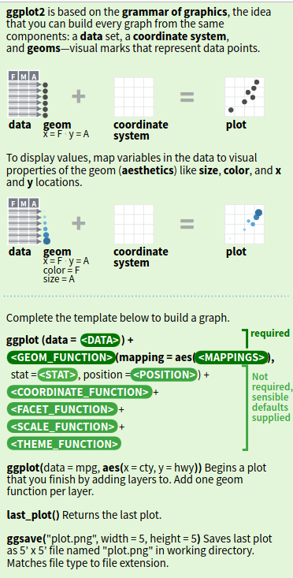
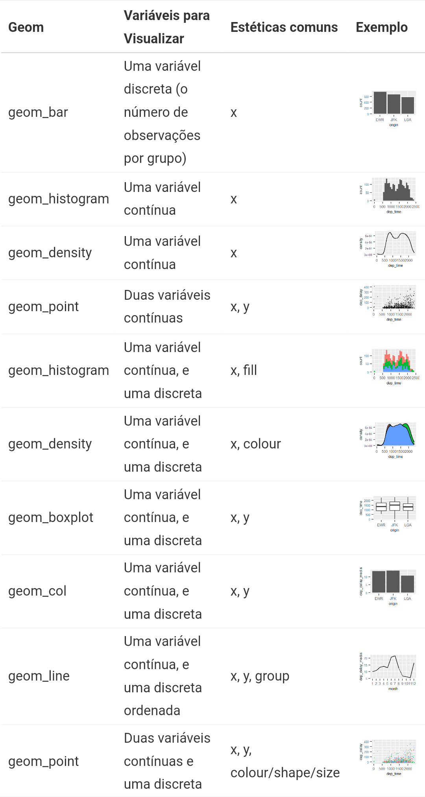

Tutorial 11
================

# Gramática de gráficos (*ggplot*)

Antes de mais nada, acesse a [página](https://ggplot2.tidyverse.org/) do
projeto do *Tidyverse* (e especificamente, do ggplot). Tenho recomendado
a vocês que usem a função *help()* rotineiramente, né?! Mas acabei me
esquecendo de dizer que todo o conteúdo dos pacotes *R Documentation*
também está disponível na web - e no caso de grandes pacotes, acaba
trazendo mais coisa que o que você encontra no *help()*.

Certo, agora podemos começar.

Como já passamos pela gramática da manipulação de dados, vendo como
construir e manipular bancos de dados, estamos aptos a iniciar o
aprendizado na gramática dos gráficos (*ggplot*). Você vai perceber que
tem diferenças sensíveis com o que já aprendeu até agora, mas ela só é
possível a partir de tudo que vimos. Em suma, para produzir um gráfico
precisamos saber qual a classe das variáveis que queremos representar
graficamente e como podemos manipular e relacionar as informações
previamente. Isso já ficará mais claro.

A primeira coisa a notar é que produzir um gráfico via programação tem
etapas e funcionamento distintos de fazê-lo manualmente ou por algum
software de edição de planilhas. A partir de agora, devemos definir
TODOS os elementos do gráfico previamente dentro dos
atributos/parâmetros da função/comando. Claro que você poderá alterar o
‘bloco de código’ que deu origem ao seu gráfico, mas cada gráfico
produzido passa a ser um produto ‘acabado’ assim que você apertar sua
tecla enter e executar.

Mas, voltemos ao que disse da necessidade de conhecer a classe das suas
variáveis.

Lembre-se que um gráfico nada mais é que uma forma resumida de informar
os dados que estão em seu banco de dados. É uma forma alternativa e
simples, por que permite que tenhamos uma ideia global das informações
que estão nas variáveis de seu banco. Entretanto, essa forma resumida
tem alguns padrões específicos, por exemplo, você não conseguiria
representar uma variável de índice de preços num gráfico de pizza. Para
cada classe de variável há um certo conjunto de representações gráficas
possíveis.


|                            **Variáveis Discretas** |                       **Variáveis Contínuas** |
|---------------------------------------------------:|----------------------------------------------:|
|    Elementos gráficos independentes ex. histograma | Elementos gráficos que variam de modo gradual |
| Variáveis tipo *characther*, *factor* e *interger* |                     Variável do tipo *double* |


Neste sentido, os gráficos que vão representar variáveis discretas devem
ser ‘mapeadas’ (já veremos o que isso quer dizer) para elementos
gráficos independentes - como colunas e histogramas. Isso acontece, pois
a transição dos valores assumidos pela variável é rígida. Você pode
encarar cada transição como um degrau de uma escada (ex. “SIM, NÃO”;
“Ótimo, Regular, Ruim”; “1,2,3,4,5”; “Manhã, Noite” etc).

Já as variáveis contínuas (*double*) serão ‘mapeadas’ por elementos
gráficos que admitem transição e, portanto, possuem transição contínua -
agora, invés de degraus, imagine a variável como uma subida em linha
reta, sem saltos ou quedas. Por isso, os gráficos que representam
variáveis contínuas variam gradualmente num ‘continuum’ - como é o caso
de densidades, escala de cores, variações de temperatura, toxicidade
etc.

É claro que você poderá recodificar sua variável a qualquer tempo (ex.
transformando uma escala de temperatura em “frio, ameno, quente,
equatorial”), mas seu gráfico decorrente - por óbvio - também deverá ser
adaptado para essa nova classe que sua variável assumiu.

Uma última coisa, antes de mergulharmos na sintaxe do *ggplot*, é dizer
que toda informação que vai ser traduzida em um gráfico advém de um
objeto do tipo “tibble” (que são data frames, com pequenas diferenças)
e/ou “data frame”. Onde as colunas são suas variáveis e as linhas são as
observações/indivíduos que assumem valores diversos para cada
coluna/variável. Neste sentido, cada linha será uma ‘unidade’ que virá
exibida no gráfico e cada coluna determinará o aspecto visual (posição,
tamanho, cor, forma, disposição…). Se ficou confuso, tudo bem. Isso é
para dizer que só podemos traduzir nossos dados em gráficos, depois de
termos organizado as informações do banco para um formato apropriado à
visualização.

## Grammar of Graphics (gg)

O pacote *ggplot* faz parte da biblioteca do *tidyverse*, então ele já
está instalado no seu computador a esta altura. Por este motivo, podemos
usufruir das facilidades do operador pipe %\>% na hora de construir
nossos gráficos! Podemos incorporar a construção de um gráfico ao bloco
de código de manipulação de dados sem nenhuma dificuldade, embora seja
mais comum individualizar os blocos de gráficos.

``` r
# Carregando tidyverse (e, portanto, ggplot)
library("tidyverse")
```

A sintaxe do *ggplot* vai trazer uma novidade, entretanto. Para unir o
bloco de código de manipulação de dados ao de construção de gráficos
devemos utilizar o símbolo de positivo (**+**) ao invés do operador
pipe. Vejamos um exemplo abaixo.

``` r
# Carregando pacote que especifica operações
library("tidylog")

# Carregando database pré-instalada
library("nycflights13")

# Manipulando 'flights' e gerando gráfico de dispersão de 'dep_time' e 'dep_delay'
flights %>% 
  filter(dest == "DEN") %>%
  ggplot() + 
  geom_point(aes(x = dep_time, y = dep_delay), size = 1)
```

O que acabou de acontecer? Você fez seu primeiro gráfico. Certo, mas
como? A primeira coisa a se notar é que usamos o banco ‘flights’, depois
de realizar um filtro das linhas assumiam “DEN” na variável ‘dest’. Logo
após, com o operador pipe %\>% informei ao R que iria construir um
gráfico deste resultado.

Atenção agora. **Após** informar que iria construir um gráfico, eu
utilizei o sinal positivo (**+**) - e não o operador pipe - para
adicionar uma função específica do *ggplot* que é destinada à construção
de gráficos de dispersão (*geom_point*).

Duas coisas aqui que já havíamos aprendido, mas serão diferenças bem
frequentes na produção de gráficos:

- 1)  Não é preciso ‘guardar’ o resultado (gráfico) em um objeto do seu
      *Global Environmet*, já que ao executar seu bloco de código, o já
      fica disponível para você salvar externamente.

- 2)  O resultado do bloco de código que você mandou rodar, que é um
      gráfico, não aparece no seu Console, mas sim, lá na janela direita
      inferior do RStudio. Talvez se lembre dos primeiros encontros em
      que disse que ali seria para elementos diversos. Pois então, há
      uma aba nesta janela com o nome ‘Plots’.

Voltando ao código que executou, talvez fique mais claro se você olhar a
figura.


Você deverá construir seu bloco de código de gráficos usando o símbolo
**+**, para diferenciar das ações de manipulação/transformação de dados
do operador pipe. A opção pelo **+** decorre da própria sintaxe do
*ggplot*. Para cada característica que desejamos que esteja presente no
nosso gráfico, devemos incluir uma ‘camada’ de informação. Por esta
razão, quase que sedimentamos camada por camada as características que
devem surgir na imagem final - e usamos o símbolo **+** para sobrepor
tais camadas.

Outro detalhe importante é que a linha que traz **ggplot() +** traz o
interior dos parênteses em branco, certo? Nós não informamos nenhum
argumento, por praxe. Fazemos que todas as informações constem da
‘geometria’ (*geom\_*) indicada na linha inferior.

> ggplot(sem argumento) + geom_ALGO(com argumentos)

**Para fixar**: O operador pipe (%\>%) fará transformação/manipulação de
dados, enquanto o caractere de positivo (**+**) adiciona mais
camadas/informação ao gráfico.



## Estéticas (*aes*)

A quantidade de elementos que um gráfico pode ter é imensa. Imagine que
você poderá personalizar título, legenda, rótulos dos eixos, cores,
fundo, grade etc, portanto, ficaria complicado cobrir tudo isso por
aqui. Deixei a indicação dos livros na página do [Encontro
8](../Encontros/Encontro-8.md), por isso também.

Pois bem, você deve ter visto que existia uma função ‘*aes()*’ no código
que executou - abreviação de *aesthetics*. Ela é a responsável por
incluir estes elementos no nosso gráfico: tanto as suas variáveis
(x,y..), quanto os variantes de estilo.

São os atributos/parâmetros da função/comando *aes()* que vão determinar
a maneira como seu gráfico irá aparecer. Evidentemente, que a depender
do tipo de gráfico (‘geometria’ *geom\_*) e do seu propósito, alguns
parâmetros estarão disponíveis e outros não. Por exemplo, não há como
você preencher ‘linetype’ num gráfico de dispersão, que é construído com
pontos - e não linhas -. Assim, para um gráfico de dispersão você poderá
alterar a forma dos pontos com o atributo ‘shape’.

De toda maneira, vejamos as mais comuns:


| Estética (aes) |                Descrição |
|---------------:|-------------------------:|
|              x |   Posição face ao eixo x |
|              y |   Posição face ao eixo y |
| colour / color |       Cor da observações |
|           fill | Cor interna à área/barra |
|          alpha |            Transparência |
|          shape |    Forma das observações |
|           size |  Tamanho das observações |
|       linetype |  \_ \_ \_ \_ …. \_\_\_\_ |
|          label |        Texto dos rótulos |


**ATENÇÃO**: Há diversas opções de estéticas (aes), mas **a
disponibilidade delas depende diretamente do tipo de ‘geometria’**
(*geom\_*) aplicada aos dados.

Uma coisa bem legal do *ggplot* é que as estéticas podem ser ‘igualadas’
a variáveis, sem que você precise indicar qual valor da observação deve
assumir qual variante de estética. De um jeito mais fácil de
compreender, ao invés de colocar nos argumentos de *aes()* uma tipo de
forma para quando a variável assumir um valor e outra forma para quando
assumir outro, basta que eu iguale ‘shape = variavel’ e o *ggplot()*
fará a mágica acontecer.
  


  
Veja com calma o que aconteceu aí na figura. Primeiro, temos somente um
ponto para cada voo (‘flights’ - unidade é o voo). Depois, passamos a
ter uma variável em ‘x’ (dep_time) e outra em ‘y’ (dep_delay). Depois,
querendo incluir mais variáveis no meu gráfico, uso ‘shape’, ‘size’ e
‘colour’ para elas.

**Obs.** O *ggplot* aceita colour (britânico) e color (estadunidense).

Simples e com imenso potencial, certo! Com apenas uma palavra, o R
entrega gráficos bem legais!

Mas atenção, há algumas práticas que devem ser evitadas, já que quando
traduzimos informações em gráficos estamos, necessariamente,
simplificando. Por este motivo, você já deve ter visto gráficos que
desinformam muito mais que informam. Recomendo cautela ao associar
muitas variáveis num mesmo gráfico e você pode encontrar muito material
sobre visualização de dados e boas práticas na internet. Tente ‘how to
lie with charts’ ou algo assim no google. Caso queira algo resumido,
pode tentar
[aqui](https://handsondataviz.org/how-to-lie-with-charts.html).

Voltando…

Há duas maneiras de especificar as estéticas de camada do seu gráfico:

- Variando conforme com os dados: Neste caso, a definiremos como uma
  variável no interior da função *aes()*, ou seja, como seu parâmetro.

> geom_point(aes(x = arr_time, y = arr_delay, shape = origin, size =
> distance, colour = carrier))

- Fixas e constantes para todas as observações: Para estes casos, o
  parâmetro será um valor único ao invés de uma variável e aparecerá
  ‘por fora’ de *aes()*.

> geom_point(size=10, alpha=0.7)

## Geometrias (*geom\_*)

Se ontem vimos que a parte mais complicada de executar um *join* era
compreender qual deveríamos aplicar e para que; agora também a parte
mais difícil acaba sendo anterior ao código. Embora estejamos sempre
orientados pelo tipo de variável que queremos representar graficamente,
escolher a geometria certa pode ser um tanto desafiador - especialmente,
por que são inúmeras com suas inúmeras estéticas possíveis.

Abaixo você encontra algumas das opções de geometrias do *ggplot*,
lembrando que todas sempre iniciarão com *geom\_*:


  
  
### Geometria de uma variável discreta (n do grupo)

Vamos começar pelo mais simples. Quando queremos representar uma
variável discreta e pedimos para o R nos informar o número de
observações que assumem cada valor possível desta variável. Se usarmos o
nosso já conhecido ‘flights’, como poderíamos fazer a representação
gráfica da variável ‘origin’. Ou seja, como poderia fazer um gráfico que
mostrasse o número de voos saindo de cada aeroporto de origem no banco
de dados ‘flights’? Tente o código abaixo.

``` r
# Gráfico de barras
flights %>% 
  ggplot() +
  geom_bar(aes(x=origin))
```

Primeiro, perceba que eu iniciei meu código de gráfico com *ggplot()*
seguido do **+**, mas não informei nada nesta linha. Para que nós
adicionemos uma geometria, temos que adicionar uma função do tipo
*geom\_*. Poderíamos acrescentar outras camadas? Sim! Cada **+** que
inserirmos é uma nova camada (desde que seja possível ao tipo de dado).

Além disso, percebeu que no ‘eixo y’, que não informei no meu código,
temos “count” como ‘label’(rótulo)?! A geometria *geom_bar()* cria
gráficos de barras e funciona para variáveis discretas sem a necessidade
que informemos uma variável para o ‘eixo y’. Este vai funcionar como
contagem do número de vezes que cada valor possível na variável
apareceu. De maneira mais técnica, quando peço para o R analisar os
dados por origem, que é uma variável discreta (factor/character) que
assume somente três valores, sem indicar uma outra variável para
funcionar como ‘y’, o R só pode fazer a contagem do número de vezes que
cada valor apareceu para o total de linhas da tabela, certo?

E é por isso que usamos *geom_bar()*, que faz a contagem de frequência
de cada categoria da variável.

**Obs.** Caso você esteja usando o RMarkdown (parabéns!), ao incluir um
bloco de código que produz um gráfico, o seu relatório final (pdf, doc,
html) o trará no lugar em que você colocou seu ‘chunck’. Não é preciso
salvar e incluir posteriormente, o RMarkdown já faz isso pra você. Além
disso, você também pode pedir para salvar o gráfico como um objeto (que
ficará lá no seu *Global Environment*). Neste caso, é só colocar o nome
do objeto num ‘chunck’ que funcionará do mesmo jeito).

### Gráficos de uma variável contínua - *geom_histogram()*

Agora, vamos ver geometrias para uma variável contínua (*double*).

Como não temos variáveis verdadeiramente contínuas, já que até os
horários são discretos (variando por minuto), temos que realizar uma
operação matemática para criar uma variável deste tipo.

``` r
# Transformando para obter variável contínua
flights <- flights %>% 
  mutate(vel = distance/air_time) 
```

Feito isso, tente agora apenas alterar o valor do atributo ‘x’ dentro de
*geom_bar(aes(x = ))*. Veja o que acontece.

``` r
# Criando um gráfico de barras com uma variável contínua
flights %>% 
  ggplot() +
  geom_bar(aes(x = vel))
```

O seu gráfico provavelmente está bem estranho ou você recebeu um
‘warning’ informando que o R excluiu várias linhas da sua variável - a
depender da sua versão do R e sistema operacional. Se apareceu um
gráfico, ele tem algumas linhas bem finas e muito espaço vazio, certo?

O que aconteceu? Escolhemos a geometria errada! Como vel (velocidade)
passou a ser uma variável contínua, quando fazemos um código pedindo
para o R executar uma geometria feita para variáveis discretas, o
resultado é uma única barra para cada um dos voos (linhas/observações na
tabela). Como o resultado do valor de velocidade é quase único para cada
observação, são milhares de linhas muito finas como barras minúsculas. O
resultado passa a não fazer sentido algum!

Para que funcione, precisamos usar a geometria correta. O gráfico
equivalente ao gráfico de barras para uma variável contínua é um
histograma (olá, Statistics 101) e por isso devemos usar o
*geom_histogram()*.

``` r
# Gráfico histograma da variável velocidade
flights %>% 
  ggplot() +
  geom_histogram(aes(x = vel))
```

O que aprendemos com isso? **É o tipo da variável que demanda a escolha
da geometria! E jamais o inverso!**. Usamos este primeiro exemplo
simples, de uma variável, para que perceba que o mais difícil é escolher
a geometria adequada e não escrever seu código. Há inúmeros exemplos,
manuais e tutoriais na internet para isso.

Você pode se perguntar, por que ainda tenho ‘warnings’? Lembra que vimos
no primeiro encontro que ‘warnings’ não necessariamente são erros? Este
é um dos casos. O ‘warning’ está aí para te informar que o R, por
*default* desta geometria, excluiu as linhas que tinham *missing
values*. Como era provavelmente o que você precisa representar
graficamente, está tudo bem.

### Parâmetros fixos *vs* Parâmetros dependentes

As geometrias *geom\_()*, como qualquer outra função do R, foram
desenhadas uma estrutura específica de parâmetros e um *default*. Por
esta razão, há parâmetros bem úteis **da própria geometria**, que
alteramos ‘por fora’ do *aesthetics - aes()*. O que isso quer dizer?
Tome o exemplo do histograma que acabamos de fazer. Há uma largura
*default* das barras, que podemos modificar. Esta característica é um
parâmetro da geometria (*geom\_*) e não de aesthetics (*aes*).

``` r
# Alterando parâmetro fixo 'largura da barra', da geometria histograma
flights %>% 
  ggplot() +
  geom_histogram(aes(x = vel), binwidth = 1)
```

Percebeu que ‘binwidth’ veio ‘por fora’ de *aes*, mas dentro do
parênteses da geometria? Isso aconteceu, pois ‘binwidth’ é um parâmetro
fixo da geometria histograma.

<div align="center">

|    Parâmetros Fixos | Parâmetros Dependentes |
|--------------------:|-----------------------:|
|     Fora do *aes()* |      Dentro do *aes()* |
| Independe dos dados |   Dependente dos dados |

</div>

Dito isso, como deixaríamos o gráfico um pouco mais colorido? Está com
um aspecto ruim, certo? Onde deveríamos especificar os parâmetros das
cores - que você viu faz pouco tempo, podendo ser ‘color’ ou ‘colour’?

Qual foi sua resposta? Se foi por dentro do *aes()* você errou. Por que?
Como a cor das barras independe dos valores que encontramos nas
variáveis, esta informação deve vir por fora do *aes()*. Para isso,
usamos os parâmetros ‘fill’ (preenche internamente) e ‘colour’/‘color’
(preenche a borda). Há exceções raras, mas normalmente os
argumentos/parâmetros ‘fill’ e ‘colour’/‘color’ funcionam para várias
geometrias.

``` r
# Alterando as cores do histograma
flights %>% 
  ggplot() +
  geom_histogram(aes(x = vel), binwidth=1, colour="darkred", fill="yellow")
```

Exagerado, não? Há boas práticas na hora de escolher as cores que vão
ser mostradas nos seus gráficos também. Há bons livros e materiais sobre
isso, inclusive com indicações nos livros que remendei para o encontro
de hoje.

Certo, mas e o que aconteceria se você colocasse ‘colour’/‘color’ dentro
do *aes()*?

``` r
# Histograma com erro
flights %>% 
  ggplot() +
  geom_histogram(aes(x = vel, colour="darkred"), binwidth=1, fill="yellow")
```

O R iria ler que ‘colour’ é uma variável e indicaria na legenda. Não
teria significado lógico nenhum e não faria nenhum tipo de operação.

### Gráficos de densidade *geom_density()* - Ainda uma variável contínua

Evidente que temos mais de uma geometria para representar um mesmo tipo
de variável. O exemplo mais simples talvez seja o odioso gráfico de
pizza do Excel e seu congênere gráfico de barras. Assim, a depender do
tipo da variável e o que ela representa na prática, podemos utilizar
gráficos distintos.

Caso você queira um gráfico mais robusto que o histograma, você pode
usar o gráfico de densidade (*geom_density*), extremamente comum no
estudo de cálculo e estatística. Enquanto o histograma estabelece níveis
para cada barra, colapsando os valores dentro de determinado patamar… O
Gráfico de densidade alinha cada observação no seu valor original.

Veja como ficaria o gráfico de densidade da mesma variável que criamos
para o histograma.

``` r
# Gráfico de densidade da variável velocidade
flights %>% 
  ggplot() +
  geom_density(aes(x = vel))
```

Bacana, né? Mas vamos exercitar e melhorar a estética deste resultado.
Que tal mudar a cor da linha? Acho que agora você já compreendeu onde
deve ir o parâmetro ‘color’, certo?

``` r
# Gráfico de densidade com linha azul
flights %>% 
  ggplot() +
  geom_density(aes(x = vel), colour="blue")
```

Ainda muito simples? Talvez a geometria do gráfico de densidade aceite
preenchimento com o atributo ‘fill’. Tente você e veja como fica.

Acertou onde fica o parâmetro? Trata-se de um parâmetro fixo, hein?!
Bom, acredito que tenha acertado. Mas provavelmente deixou uma cor
diferente ou a mesma cor do contorno, correto? Uma cor sólida, imagino.

Que tal, então, variar a intensidade da cor que acabou de inserir no
gráfico? Para isso, usamos o parâmetro ‘alpha’, que admite valores que
partem de 0 (transparente) até 1 (cor sólida).

``` r
# Usando alpha para suavizar cores
flights %>% 
  ggplot() +
  geom_density(aes(x = vel), colour="red", fill = "red", alpha = 0.3)
```

Parece melhor, não? Agora, é bem comum que um gráfico tente traduzir
muitas informações de maneira veloz ao leitor. Por isso, seria
interessante informar a média desta distribuição (da variável vel) e,
para isso, podemos colocar uma linha vertical indicando.

Claro que antes de inserir a linha (como uma nova camada! Coisa nova
aqui), precisamos calcular a tal média, certo? Mas a esta altura você já
sabe fazer isso \> summarize(mean()). Há um detalhe no código,
entretanto, que é usar a função *pull()* para que o resultado se
converta em um vetor unidimensional com um único valor — Execute sem o
pull e veja a diferença!

``` r
# Calculando a média para usar no gráfico de densidade
vel_media <- flights %>% 
  summarize(vel_media = mean(vel, na.rm = TRUE)) %>% # lembre de excluir os NA's.
  pull(vel_media)
```

Você poderia ter executado sem *pull()* e feito manualmente a criação do
objeto vel_media. Sim, poderia. Mas se queremos automatizar tarefas e
rotinas, quanto menos interações que você tenha que ter para o código
rodar inteiro, mais otimizado estará seu tempo e trabalho!

Certo, agora temos um valor (‘values’) lá no *Global Environment* e
podemos usá-lo. Mas talvez você tenha ficado com essa dúvida: O
histograma tem barras verticais alinhadas, enquanto o gráfico de
densidade parece bem fluído. Como raios vou fazer para inserir uma linha
vertical? Simples: uma nova camada!

Lembra-se que dissemos no começo que você poderia inserir quantas
camadas quisesse, desde que fizessem sentido e/ou a estrutura do código
permitisse? Então, aqui é um destes casos. Além do *geom_density()*,
iremos inserir uma camada com outra geometria: *geom_vline()*. Ela terá
seus próprios argumentos/atributos, dos quais a função *aesthetics*
*aes()* é um deles. Veja como ficaria:

``` r
# Inserindo nova camada de linha vertical
flights %>% 
  ggplot() +
  geom_density(aes(x = vel), colour="red", fill = "red", alpha = 0.3) +
  geom_vline(aes(xintercept = vel_media))
```

Perceba uma coisa. Enquanto *geom_density(aes())* tem ‘x’ para atribuir
o nome da variável, para *geom_vline(aes())* o nome da variável é
‘xintercept’. Como eu sei disso? Cada função tem sua própria estrutura e
dá nomes diferentes para seus atributos - Use *help()*.

Então, vamos usar outro parâmetro fixo de estética? Desta vez, que tal
mudar a característica da linha vertical, que por *default* é sólida?
Onde iria o parâmetro ‘linetype’?

``` r
# Alterando estética da linha vertical
flights %>% 
  ggplot() +
  geom_density(aes(x = vel), colour = "red", fill = "red", alpha = 0.3) +
  geom_vline(aes(xintercept = vel_media), linetype = "dashed", colour = "red")
```

Vamos tentar fazer alguns gráficos, agora? Acho que já temos material
para tentar algumas coisas.

- Faça você mesmo

  - 1)  Faça um gráfico de barras com o número mensal de voos (banco de
        dados ‘flights’).

  - 2)  Faça um gráfico de barras com o número de voos por companhia
        (carrier) saindo do aeroporto JFK (‘origin’).

  - 3)  Faça um gráfico de densidade com a distribuição do tempo de voo
        (air_time) entre os aeroportos JFK e LAX.

### Gráficos com duas variáveis: Contínua + Discreta

Vamos deixar as coisas mais interessantes agora. Nossos eixos ‘x’ e ‘y’
serão variáveis de nossa tabela, mas sendo uma delas contínua e outra
discreta. É o que acontece, por exemplo, quando queremos conhecer a
distribuição de uma variável contínua em subgrupos definidos em
categorias de outra variável.

Tomando nosso amigo ‘flights’, isso aconteceria quando criasse um
gráfico para visualizar o horário de partida (dep_time) em cada
aeroporto de origem (‘origin’). Você não precisaria filtrar tudo por
origem e depois fazer um gráfico separado para cada aeroporto! É muito
mais fácil e econômico pedir que o *ggplot* construa uma representação
gráfica usando as duas variáveis: ‘dep_time’ (contínua) e ‘origin’
(discreta). Para isso, adicionamos ‘y’ ao *aesthetics*.

Se formos usar o histograma, podemos usar um **parâmetro dependente**
para representar a variável ‘origin’ que só admite três possibilidades.
Veja só como ficaria o código:

``` r
# Histograma de uma variável contínua e outra discreta
flights %>% 
  ggplot() +
  geom_histogram(aes(x = dep_time, fill = origin))
```

Viu que agora o parâmetro ‘fill’ está por dentro de *aes()*?! Por que
agora, ele **depende** dos dados! E fica bem bonito, não é mesmo? A
variável ‘origin’ irá dividir as distribuições de velocidade e é
representada nas diferentes cores nas colunas. E agora temos uma
**legenda**, certo?

Poderíamos melhorar ainda mais este gráfico, fazendo com que as colunas
coloridas saíssem uma de cima das outras. A depender do seu problema e
da distribuição dos dados, pode ser mais interessante que as colunas
apareçam lado a lado. Perceba que esta operação refere-se a um parâmetro
fixo e por isso ‘position’ vai por fora de *aes()*.

``` r
# Alterando parâmetro de exibição da variável discreta
flights %>% 
  ggplot() +
  geom_histogram(aes(x = dep_time, fill = origin), position = "dodge", binwidth=200)
```

Certo, agora vamos tentar fazer o mesmo para a geometria de densidade?
Inserindo a variável discreta no bloco de código do gráfico. Mas ao
invés de utilizar o parâmetro ‘fill’ (já que se trata de uma linha!),
iremos usar o parâmetro ‘colour’/‘color’ para representar nossa variável
discreta. Ou na prática, para que cada cor represente um dos possíveis
valores (subgrupos) que a variável ‘origin’ assume para os voos de
‘flights’.

``` r
# Gráfico de curva de densidade de uma variável contínua e uma discreta
flights %>% 
  ggplot() +
  geom_density(aes(x = dep_time, color = origin))
```

Bacana, mas talvez não seja tão efetivo comunicando as informações do
gráfico como foi o histograma, certo? Talvez, pelas características do
que aquele dado representa, um histograma seja melhor. Mas, de toda
forma, vamos treinar mais um pouco. Vamos tentar usar o ‘fill’ e ver o
resultado.

``` r
# Usando o parâmetro fixo fill
flights %>% 
  ggplot() +
  geom_density(aes(x = dep_time, fill = origin))
```

Poluído, certo? As cores se sobrepõem e você acaba perdendo algumas
flutuações. Talvez se deixasse o preenchimento mais transparente e
mantivesse as linhas sólidas?

``` r
# Usando o parâmetro fixo alpha (transparência)
flights %>% 
  ggplot() +
  geom_density(aes(x = dep_time, fill = origin), alpha=0.5)
```

Perceba a diferença! O parâmetro/atributo ‘alpha’ é um parâmetro fixo,
já que a transparência não está ligada a nenhuma variação dos dados. Por
isso, vai por fora de *aesthetics aes()*! Já ‘fill’ está sendo usado
para representar as três diferentes categorias de ‘origin’, portanto, é
um parâmetro que depende dos dados - que varia com os dados!

Para terminar por hoje, vamos reunir todas estas informações:

``` r
# Gráfico de curva de densidade de uma varíavel contínua e outra discreta
flights %>% 
  ggplot() +
  geom_density(aes(x = dep_time, color = origin, fill = origin), alpha = 10/3)
```

Bacana né!? Pois a comparação de distribuições de uma variável contínua
e outra discreta é nada mais, nada menos, que a mais recorrente na
ciência! Já que é esta forma de gráfico que representa os testes de
hipóteses de dois grupos!

Ficamos por aqui!
